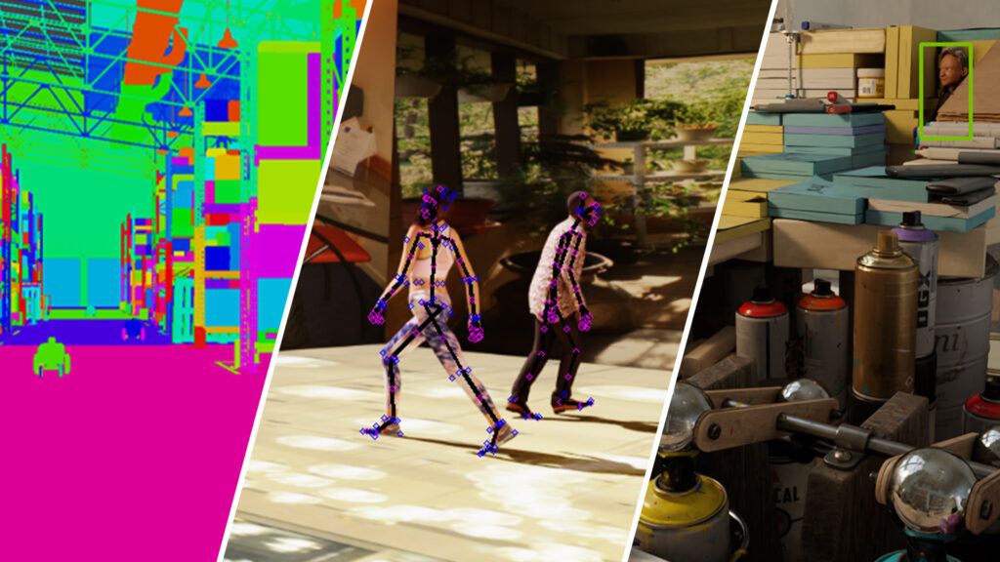

# Hi, I'm Kashyap Khunt 👋

### Robotics Software Engineer · Simulation · Computer Vision · Physical AI

## About me

I build simulation-first robotics and computer-vision systems, with hands-on experience across NVIDIA Omniverse, Isaac Sim, Isaac Lab, OpenUSD, ROS 2, industrial inspection, and humanoid robotics.

My work sits at the intersection of **robotics simulation, synthetic data, perception, and physical AI**. I enjoy turning research ideas into reproducible engineering workflows that can be inspected, tested, and extended.

## Technologies & tools

- **Robotics & simulation:** NVIDIA Omniverse, Isaac Sim, Isaac Lab, OpenUSD, ROS 2, Nav2
- **AI & computer vision:** PyTorch, TensorFlow, OpenCV, YOLO, DETR, reinforcement learning, VLA models
- **Programming & integration:** Python, C++, Docker, MQTT, Git
- **Platforms & applications:** Unitree G1, Universal Robots, industrial inspection, synthetic data generation

## Featured projects

| Project | Engineering focus | Evidence |
| --- | --- | --- |
| [Synthetic Data for Quality Inspection](https://github.com/Kashyap012/isaac-sim-synthetic-inspection) | Isaac Sim, OpenUSD, Replicator-style domain randomization, annotation conversion, YOLO/DETR evaluation | Master's thesis case study with approved result visuals and reusable conversion code |
| [Isaac Lab Assembly Benchmark](https://github.com/Kashyap012/isaac-lab-assembly-benchmark) | RL policy evaluation for robotic insertion and assembly | Reproducible benchmark metrics, configuration, sample episode, and tests |
| [ROS 2 Industrial Sensor Monitor](https://github.com/Kashyap012/ros2-industrial-sensor-monitor) | ROS 2, industrial sensing, health monitoring, MQTT-oriented integration patterns | Runnable core logic with tests and a ROS 2 adapter |

## GitHub activity

## Experience highlights

- Designed an automated synthetic-data and computer-vision workflow for industrial quality inspection using NVIDIA Isaac Sim and OpenUSD.
- Trained and evaluated YOLO and DETR object-detection models, reporting 94% accuracy on real inspection images in the thesis project.
- Prototyped Unitree G1 concepts involving ROS 2, cameras, LiDAR, perception, teleoperation, locomotion, and industrial use cases.
- Integrated robot-guided computer-vision inspection with Universal Robots cobots, cameras, sensors, and AI-based image analysis.
- Developed an Isaac Lab reinforcement-learning policy study for precision screw insertion and robotic assembly.

## Engineering principles

- Reproducible configurations and explicit environment assumptions
- Honest separation between public reconstruction, experimental results, and production deployment
- Measurable evaluation with documented failure modes
- Attribution for upstream open-source foundations and third-party assets

## Connect with me

[LinkedIn](https://www.linkedin.com/in/kashyapkhunt/) · [GitHub](https://github.com/Kashyap012)

Open to robotics, simulation, perception, embodied AI, and industrial-automation roles.

